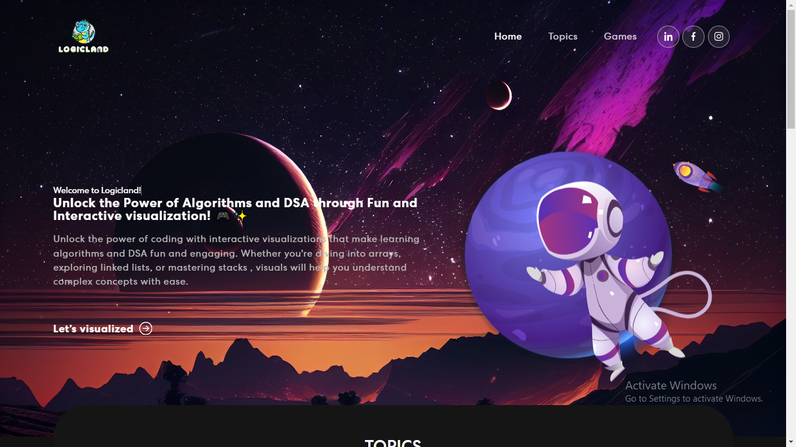
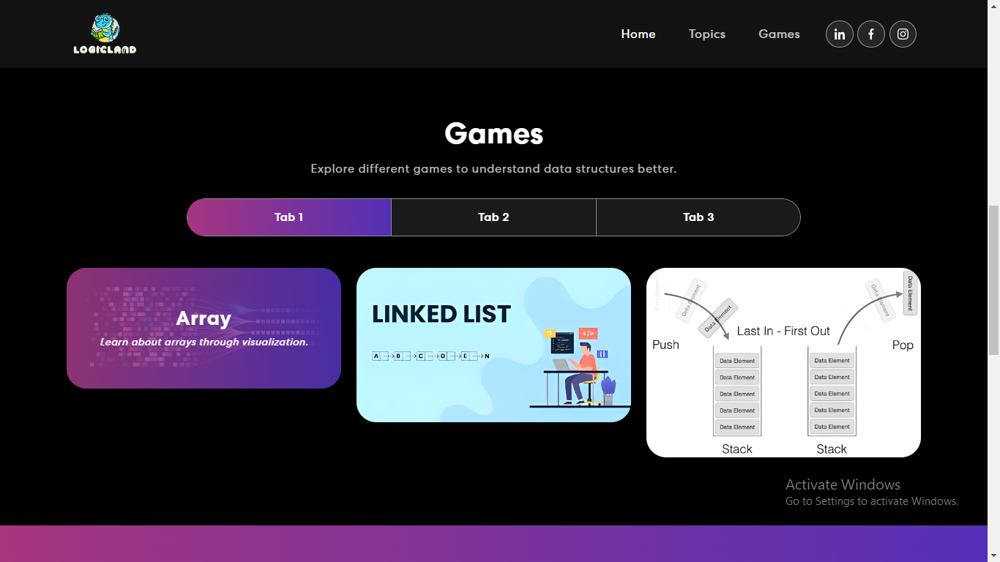
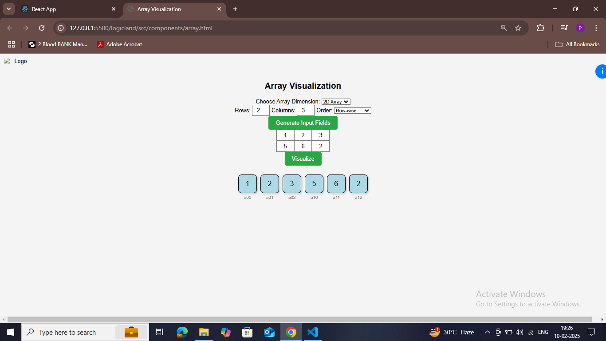
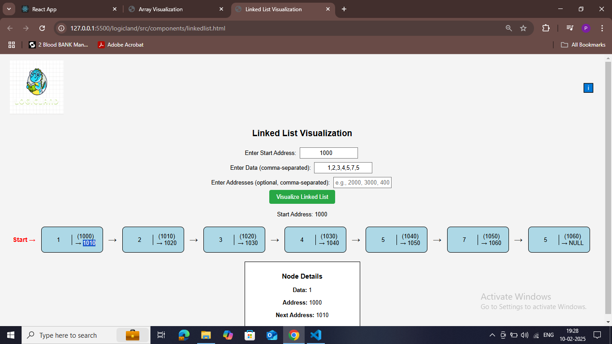
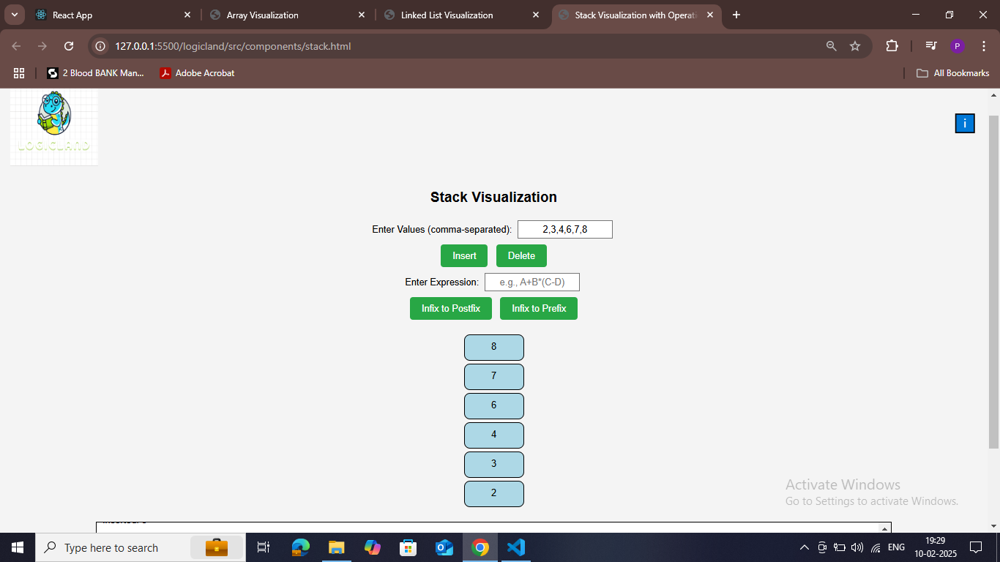

# LogicLand



LogicLand is an interactive web application designed to help users visualize and understand data structures through interactive gameplay and visual representation.

## Features

- **Navigation Bar:** Provides easy access to different sections.
- **Banner:** Displays an introduction or welcome message.
- **Skills Section:** Highlights key technologies or skills.
- **Projects Section:** Showcases various projects or features within the app.
- **Contact Section:** Allows users to get in touch.
- **Footer:** Contains additional information and links.

## Installation

### Prerequisites

- Node.js (>= 14.x recommended)
- npm or yarn

### Steps to Run Locally

1. Clone the repository:
   ```sh
   git clone https://github.com/Piyush8378/logicland.git
   cd logicland
2. Create a new React app (if not already set up):
   ```sh
   npx create-react-app logicland
   cd logicland
3. Install dependencies
   ```sh
   npm install

4. If you encounter the error:
   Cannot find module 'ajv/dist/compile/codegen'
   ```sh
   npm install --save-dev ajv@^7
5. Install required dependencies:
   ```sh
   npm install bootstrap react-bootstrap react-bootstrap-icons animate.css react-on-screen react-router-dom react-router-hash-link react-mailchimp-subscribe react-multi-carousel

6. Verify react-multi-carousel styles by ensuring you have the correct import in Skills.js:
   ```sh
   import 'react-multi-carousel/lib/styles.css';


7. If issues persist, clear and reinstall dependencies:
   ```sh
   rm -rf node_modules
   npm install

8. Start the development server:
   ```sh
   npm start

9. Open your browser and go to http://localhost:3000/


## Technologies Used

- **React.js** - Frontend framework
- **Bootstrap** - Styling and layout
- **CSS** - Custom styles
- **Data Structures** - Core algorithms and implementations

## Output Screenshots

Here are example outputs of the application:





 

## Contact
For any queries, reach out at sharmapiyush.8378@gmail.com.


